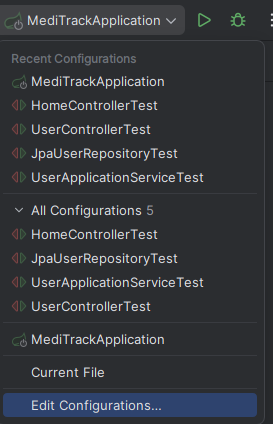
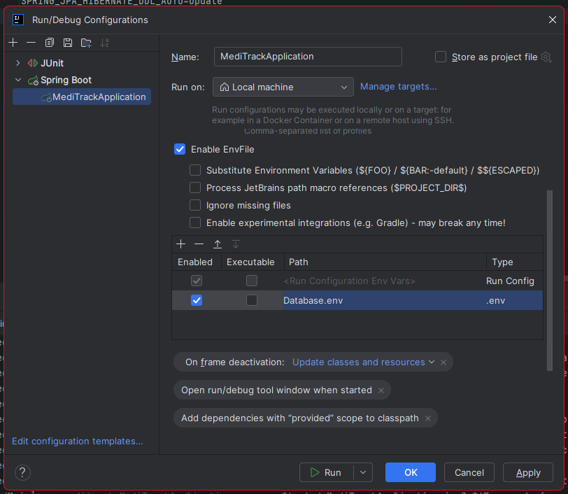

## Datenbank-Konfiguration

Datenbank-Zugangsdaten werden **nicht** im Klartext im Repo gespeichert.

Stattdessen:

1. `Database.env.example` enthält eine Vorlage der benötigten Variablen.
2. Jede:r Entwickler:in erstellt lokal eine Datei `Database.env` mit echten Werten.
3. `Database.env` ist in `.gitignore` eingetragen und wird nicht committed.

Benötigte Variablen:

- `SPRING_DATASOURCE_URL`
- `SPRING_DATASOURCE_USERNAME`
- `SPRING_DATASOURCE_PASSWORD`
- `SPRING_JPA_HIBERNATE_DDL_AUTO`

ToDo: In IntelliJ das Plugun: EnvFile runterladen, dann neustart und Database.env in die Konfiguration übernehmen:

Hier folgt das DB Konstrukt....