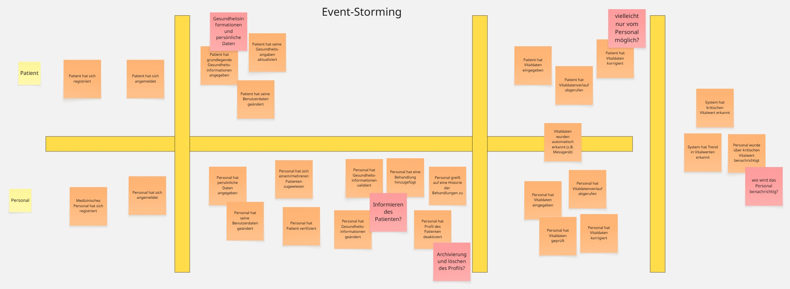
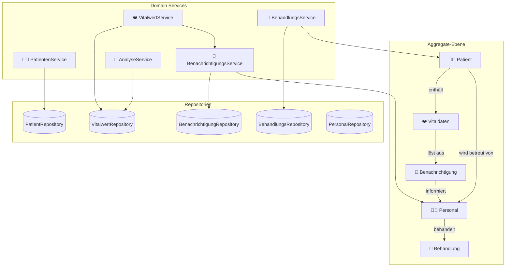
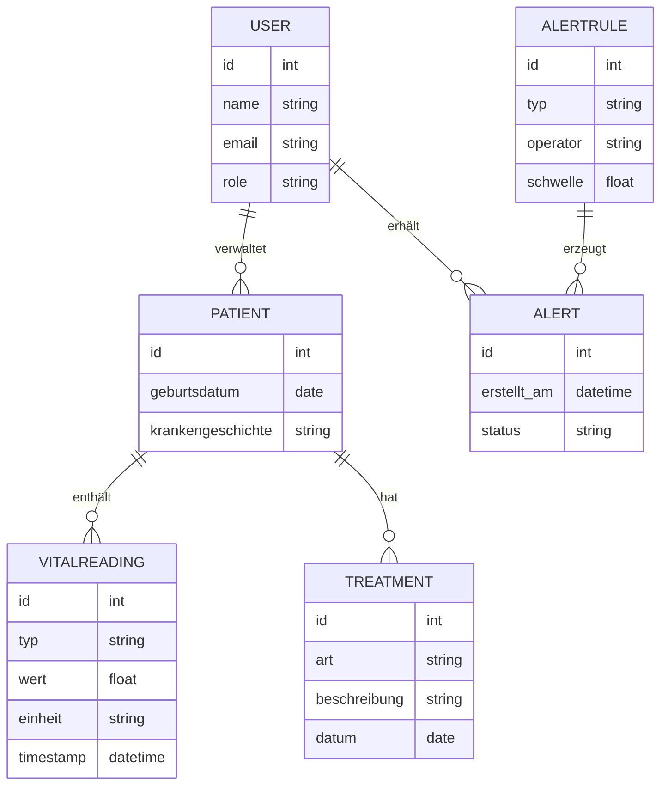
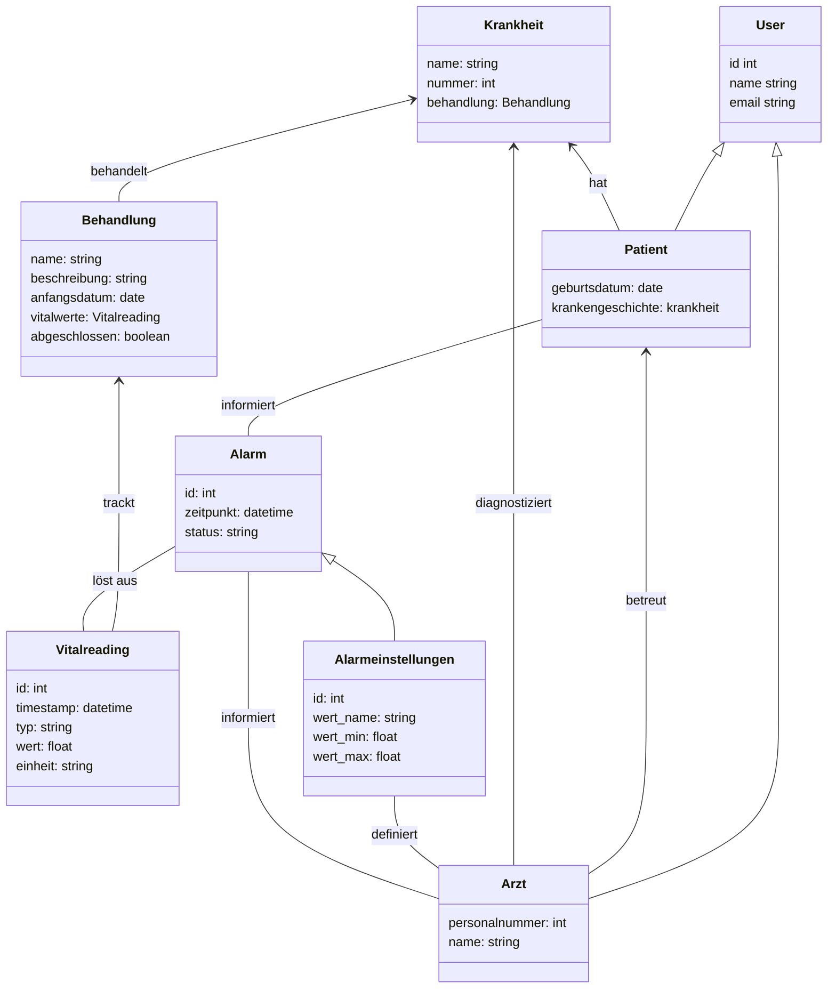

# MediTrack

**MediTrack** ist ein Projekt zur **Verwaltung und Überwachung von Patientendaten** (einschließlich Vitaldaten und Behandlungshistorie) mit automatischen **Benachrichtigungen bei kritischen Werten**. Dieses Dokument dient **ausschließlich der Orientierung und Formatierung**. Inhalte, technische Details und Umsetzungen werden **im Verlauf des Projekts fortlaufend angepasst und konkretisiert.**

---

## 📋 Projektübersicht

**Ziel:**  
Ein System, das Patientendaten sicher verwaltet, Vitalwerte überwacht und bei kritischen Schwellen automatisch medizinisches Personal informiert.

**Kernfunktionen (MVP):**
- Patientenregistrierung & Authentifizierung (mit Rollen)
- Verwaltung von Stammdaten (Name, Geburtsdatum, Krankengeschichte)
- Eingabe und Anzeige von Vitalwerten (Blutdruck, Puls, Temperatur)
- Automatisches Benachrichtigungssystem bei kritischen Werten
- Behandlungsübersicht mit Historie

---

## 👥 Team 2 – MediTrack

| Name                    | E-Mail                                   | Discord          |
|-------------------------|------------------------------------------|------------------|
| Konstantin Königshofen  | k.koenigshofen@ostfalia.de               | konstantink4120  |
| Timo Nadolny            | timo.nadolny@stud.th-luebeck.de          | nadolzetimo      |
| Marcell Wolf de Lêu     | bht@wolfdel.eu                           | wolfdeleu        |
| ~~Lea Ebitsch~~         | ~~ebitsch@th-brandenburg.de~~            | ~~leae1010~~     |
| ~~Jessica Windoffer~~   | ~~jessica.windoffer@stud.th-luebeck.de~~ | ~~j.windoffer~~  |


---

## 🧱 Projektstruktur (Vorschlag)

### 🖥️ Technologie-Stack
...

### 🗂️ Repository-Struktur

```plaintext
MediTrack/
├── backend/
│ ├── src/
│ └── target/
...
└── README.md
```

---

## ⚙️ Funktionale Anforderungen (aus Aufgabenbeschreibung)

1. **Registrierung & Login** – mit rollenbasierter Authentifizierung (Patient, medizinisches Personal)
2. **Patientendatenverwaltung** – Eingabe & Änderung grundlegender Daten
3. **Vitaldaten-Erfassung** – Blutdruck, Puls, Temperatur etc.
4. **Benachrichtigungssystem** – automatische Alarme bei Schwellenüberschreitungen
5. **Behandlungsübersicht** – Historie der Behandlungen und Eingriffe

---

## 🎯 Akzeptanzkriterien (MVP)

- **Patientenrolle:** Zugriff nur auf eigene Daten  
- **Personalrolle:** Zugriff auf zugewiesene Patienten  
- **Validierung:** Eingaben werden auf Wertebereiche geprüft  
- **Alerts:** Kritische Werte lösen Benachrichtigung innerhalb von 1 Minute aus  
- **Historie:** Änderungen versioniert & nachvollziehbar  

---

## 🧩 Eventstorming

> *Event Storming* ist eine Methode, um zwischen **Entwicklern** und **Domain-Experten** ein gemeinsames Verständnis über die Domäne und deren Prozesse zu schaffen.  
> Dabei werden die wichtigsten Ereignisse (Events) und deren Auslöser visuell dargestellt.

### 🧠 Legende
- 🟧 **Domain Event** – beschreibt eine fachliche Veränderung im System (z. B. *Patient hat Vitaldaten eingegeben*)
- 🟥 **Hot Spot** – offener Punkt, Problem oder Diskussionsbedarf
- 🟨 **Actor** – Akteur (z. B. Patient, medizinisches Personal)

---

### 🎯 Ziel
Das Ziel der Session war, die Abläufe von **MediTrack** zu verstehen und die wichtigsten Ereignisse zu identifizieren – von der Registrierung bis zur Benachrichtigung bei kritischen Vitalwerten.

---

### 🧩 Hauptakteure
| Akteur | Beschreibung |
|:--|:--|
| 🧍‍♂️ **Patient** | Gibt Gesundheits- und Vitaldaten ein, ruft Verlauf ab |
| 🩺 **Personal** | Prüft Daten, ergänzt Behandlungen, verwaltet Profile |
| ⚙️ **System** | Erkennt Trends und kritische Werte, löst Benachrichtigungen aus |

---

### 🔄 Beispielhafter Ablauf (vereinfacht)
[Patient registriert] → [Patient erfasst Gesundheitsdaten] → [Patient gibt Vitaldaten ein] → [System erkennt kritischen Wert] → [Benachrichtigung an Personal] → [Personal prüft / reagiert] → [Behandlung hinzugefügt]

---

### 📸 Visualisierung



> Die Abbildung zeigt das finale Event-Storming-Board der MediTrack-Domäne mit allen identifizierten Akteuren, Events und Hotspots.

---

## 🧩 Bounded Context

> Ein *Bounded Context* ist ein klar abgegrenzter Teil einer Software,  
> der **eigene Regeln, Strategien und eine eigene Fachsprache (Ubiquitous Language)** besitzt.  
> Domains oder Subdomains können mehrere Bounded Contexts enthalten –  
> jedoch sollte sich **ein einzelner Bounded Context niemals über mehrere Domains erstrecken.**

---

### 🧱 Überblick

| Bounded Context | Verantwortlichkeiten | Beziehung zu anderen BCs |
|:--|:--|:--|
| 🧍‍⚕️ **Registrierungsvorgang** | Patienten und medizinisches Personal können sich registrieren und anmelden. | Voraussetzung für alle weiteren Bounded Contexts. |
| 🧾 **Stammdatenerfassung** | Patienten können persönliche Daten (Name, Geburtsdatum, Krankheitsgeschichte) angeben und verwalten. | Die erfasste Krankheitsgeschichte wird vom BC **„Krankheitshistorie“** genutzt und dort erweitert. |
| 🧬 **Krankheitshistorie** | Patienten und Ärzte können auf Krankheitsverläufe zugreifen und diese erweitern. | Baut auf den Informationen aus dem BC **„Stammdatenerfassung“** auf. |
| ❤️ **Erfassung Werte** | Patienten-Vitalwerte werden erfasst, gespeichert und regelmäßig überprüft. | Wenn ein erfasster Wert den Schwellenwert überschreitet, wird das **Alarmsystem** aktiviert. |
| 🔔 **Alarmsystem / Notification-Center** | Erkennt kritische Vitalwerte und benachrichtigt das zuständige Personal. | Nutzt und überwacht die Daten aus dem BC **„Erfassung Werte“**. |

---

### 💡 Fazit
Die Aufteilung in klar definierte Bounded Contexts ermöglicht:
- eine **bessere Entkopplung** der Fachlogik,
- die **unabhängige Weiterentwicklung** einzelner Bereiche,
- und die konsequente Anwendung der **DDD-Prinzipien** (Domain Driven Design).  
  Jeder Kontext bildet damit eine eigene Mini-Domäne innerhalb von **MediTrack**.

---

## 🧩 Entitäten und Aggregate definieren

> In **MediTrack** werden zentrale Geschäftsobjekte als **Entitäten** modelliert.  
> Mehrere Entitäten mit enger fachlicher Verbindung bilden gemeinsam ein **Aggregat**,  
> das durch eine *Aggregate Root* verwaltet wird.  
> Diese Struktur sorgt für Datenkonsistenz und klare fachliche Grenzen zwischen den Bereichen.

---

### 🧱 Patientenverwaltung
- **Entität:** Patient
- **Aggregate:** Patient
    - Enthält alle Stammdaten des Patienten wie Name, Geburtsdatum, Kontaktdaten und medizinische Basisinformationen.
    - Dient als zentrale *Aggregate Root* für abhängige Daten wie Vitalwerte, Behandlungen und Benachrichtigungen.

---

### ❤️ Vitaldatenmanagement
- **Entität:** Vitalwert
- **Aggregate:** Vitaldaten
    - Beinhaltet alle Vitalparameter eines Patienten (z. B. Puls, Blutdruck, Temperatur).
    - Stellt Logik zur Erfassung, Validierung und Schwellenwertprüfung bereit.
    - Löst bei Überschreitung automatisch Events (z. B. *CriticalValueDetectedEvent*) aus, die im Benachrichtigungssystem verarbeitet werden.

---

### 🔔 Benachrichtigungssystem
- **Entität:** Benachrichtigung / Alarm
- **Aggregate:** Benachrichtigung
    - Enthält Informationen über erkannte kritische Werte, deren Status und Zustellungsdetails.
    - Wird vom *Vitaldaten*-Aggregat ausgelöst und referenziert Patient und medizinisches Personal.

---

### 🧾 Behandlungsmanagement
- **Entität:** Behandlung
- **Aggregate:** Behandlung
    - Dokumentiert alle ärztlichen Maßnahmen, Diagnosen und Verlaufseinträge.
    - Verknüpft Patient und behandelndes Personal.
    - Dient als Basis für spätere Auswertungen oder Dokumentationen.

---

### 👩‍⚕️ Personalverwaltung
- **Entität:** Benutzer (Arzt, Pflegekraft)
- **Aggregate:** Personal
    - Enthält Identitätsdaten, Rollen und Zugriffsrechte.
    - Kann mehreren Patienten zugeordnet werden und erhält Benachrichtigungen aus dem Notification-Center.

---

### 💡 Zusammenfassung
Jedes Aggregat bildet eine in sich konsistente Einheit innerhalb des Systems.  
Zwischen den Aggregaten findet die Kommunikation über Domain-Events statt  
(z. B. *Vitalwert überschreitet Grenzwert → löst Benachrichtigung aus*).

---

## ⚙️ Domain Services und Repositories

> **Domain Services** kapseln fachliche Logik, die nicht direkt zu einer Entität gehört.  
> **Repositories** sind für die Persistenz dieser Entitäten und Aggregate verantwortlich.  
> Zusammen stellen sie die Schnittstelle zwischen Fachlogik und Datenhaltung dar.

---

### 🧠 Domain Services

| Service | Aufgabe | Zugehöriger Bounded Context |
|:--|:--|:--|
| 🧍‍⚕️ **PatientenService** | Verwaltung der Patientenstammdaten (Erstellen, Aktualisieren, Löschen, Zuweisung an Ärzte) | Patientenverwaltung |
| ❤️ **VitalwertService** | Erfassen, Prüfen und Validieren eingehender Vitaldaten; Erzeugung von Alarm-Events bei Grenzwertüberschreitung | Vitaldatenmanagement |
| 🔔 **BenachrichtigungsService** | Erstellen und Versenden von Benachrichtigungen an zuständiges Personal | Benachrichtigungssystem |
| 🧾 **BehandlungsService** | Verwaltung von Behandlungen, Diagnosen und Verlaufseinträgen | Behandlungsmanagement |
| 🧠 **AnalyseService (optional)** | Analysiert historische Vitaldaten, erkennt Trends und Muster | Vitaldatenmanagement |

---

### 💾 Repositories

| Repository | Methoden (Beispiele) | Zweck |
|:--|:--|:--|
| 🧍‍⚕️ **PatientRepository** | `findPatientById(id)`, `savePatient(patient)` | Verwaltung und Persistenz der Patientendaten |
| ❤️ **VitalwertRepository** | `findVitalwertByPatient(patientId)`, `saveVitalwert(vitalwert)` | Speicherung und Analyse der Vitaldaten |
| 🔔 **BenachrichtigungRepository** | `findAlertByStatus(status)`, `saveAlert(alert)` | Verwaltung von Alarmen und Benachrichtigungen |
| 🧾 **BehandlungsRepository** | `findBehandlungById(id)`, `saveBehandlung(behandlung)` | Zugriff auf Behandlungs- und Verlaufseinträge |
| 👩‍⚕️ **PersonalRepository** | `findPersonalByRole(role)`, `assignPatient(patientId)` | Verwaltung medizinischer Benutzerkonten und Zuweisungen |

---

### 🕸️ Übersicht der Domänenlogik


---

### 🧩 Beispielhafte Service-Interaktion

```plaintext
1️⃣ Patient erfasst neue Vitaldaten.
2️⃣ Der VitalwertService speichert die Werte im Repository.
3️⃣ Das System prüft, ob Grenzwerte überschritten wurden.
4️⃣ Bei Überschreitung: Event "Kritischer Wert erkannt".
5️⃣ Der BenachrichtigungsService erstellt eine Benachrichtigung für das zuständige Personal.
6️⃣ Das Personal reagiert darauf und dokumentiert die Maßnahme im BehandlungsService.
```
---


## 🧩 Domänenmodell (Entwurf)


## 🧩 Domänenmodell (Entwurf2)



