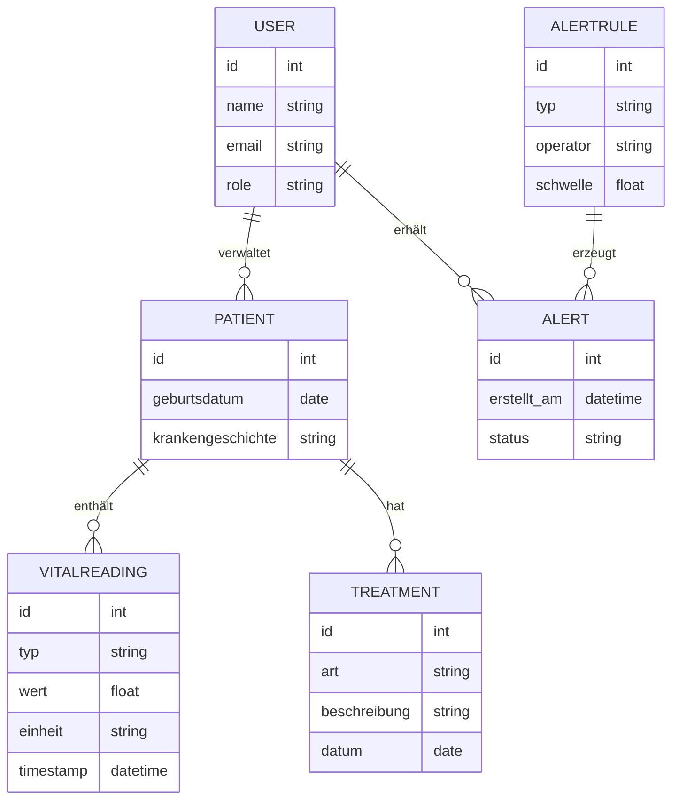
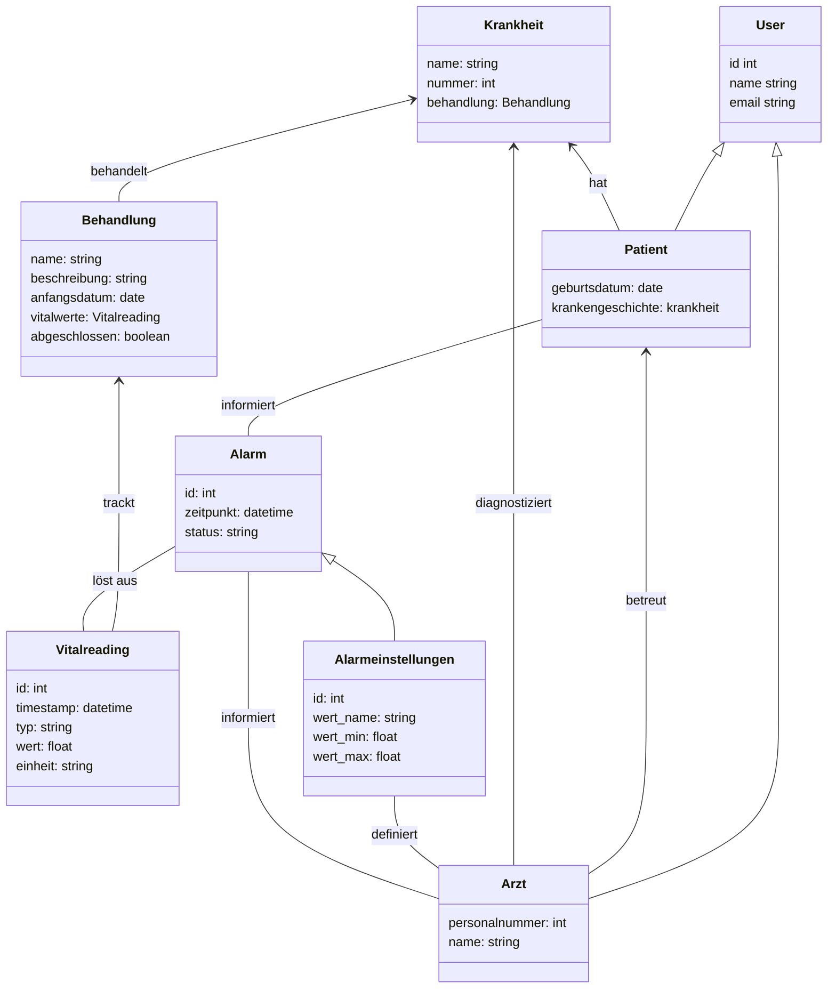

# MediTrack

**MediTrack** ist ein Projekt zur **Verwaltung und Überwachung von Patientendaten** (einschließlich Vitaldaten und Behandlungshistorie) mit automatischen **Benachrichtigungen bei kritischen Werten**. Dieses Dokument dient **ausschließlich der Orientierung und Formatierung**. Inhalte, technische Details und Umsetzungen werden **im Verlauf des Projekts fortlaufend angepasst und konkretisiert.**

---

## 📋 Projektübersicht

**Ziel:**  
Ein System, das Patientendaten sicher verwaltet, Vitalwerte überwacht und bei kritischen Schwellen automatisch medizinisches Personal informiert.

**Kernfunktionen (MVP):**
- Patientenregistrierung & Authentifizierung (mit Rollen)
- Verwaltung von Stammdaten (Name, Geburtsdatum, Krankengeschichte)
- Eingabe und Anzeige von Vitalwerten (Blutdruck, Puls, Temperatur)
- Automatisches Benachrichtigungssystem bei kritischen Werten
- Behandlungsübersicht mit Historie

---

## 👥 Team 2 – MediTrack

| Name                    | E-Mail                                   | Discord          |
|-------------------------|------------------------------------------|------------------|
| Konstantin Königshofen  | k.koenigshofen@ostfalia.de               | konstantink4120  |
| Timo Nadolny            | timo.nadolny@stud.th-luebeck.de          | nadolzetimo      |
| Marcell Wolf de Lêu     | bht@wolfdel.eu                           | wolfdeleu        |
| ~~Lea Ebitsch~~         | ~~ebitsch@th-brandenburg.de~~            | ~~leae1010~~     |
| ~~Jessica Windoffer~~   | ~~jessica.windoffer@stud.th-luebeck.de~~ | ~~j.windoffer~~  |


---

## 🧱 Projektstruktur (Vorschlag)

### 🖥️ Technologie-Stack
...

### 🗂️ Repository-Struktur

```plaintext
MediTrack/
├── backend/
│ ├── src/
│ └── target/
...
└── README.md
```

---

## ⚙️ Funktionale Anforderungen (aus Aufgabenbeschreibung)

1. **Registrierung & Login** – mit rollenbasierter Authentifizierung (Patient, medizinisches Personal)
2. **Patientendatenverwaltung** – Eingabe & Änderung grundlegender Daten
3. **Vitaldaten-Erfassung** – Blutdruck, Puls, Temperatur etc.
4. **Benachrichtigungssystem** – automatische Alarme bei Schwellenüberschreitungen
5. **Behandlungsübersicht** – Historie der Behandlungen und Eingriffe

---

## 🎯 Akzeptanzkriterien (MVP)

- **Patientenrolle:** Zugriff nur auf eigene Daten  
- **Personalrolle:** Zugriff auf zugewiesene Patienten  
- **Validierung:** Eingaben werden auf Wertebereiche geprüft  
- **Alerts:** Kritische Werte lösen Benachrichtigung innerhalb von 1 Minute aus  
- **Historie:** Änderungen versioniert & nachvollziehbar  

---

## 🧩 Eventstorming

> *Event Storming* ist eine Methode, um zwischen **Entwicklern** und **Domain-Experten** ein gemeinsames Verständnis über die Domäne und deren Prozesse zu schaffen.  
> Dabei werden die wichtigsten Ereignisse (Events) und deren Auslöser visuell dargestellt.

### 🧠 Legende
- 🟧 **Domain Event** – beschreibt eine fachliche Veränderung im System (z. B. *Patient hat Vitaldaten eingegeben*)
- 🟥 **Hot Spot** – offener Punkt, Problem oder Diskussionsbedarf
- 🟨 **Actor** – Akteur (z. B. Patient, medizinisches Personal)

---

### 🎯 Ziel
Das Ziel der Session war, die Abläufe von **MediTrack** zu verstehen und die wichtigsten Ereignisse zu identifizieren – von der Registrierung bis zur Benachrichtigung bei kritischen Vitalwerten.

---

### 🧩 Hauptakteure
| Akteur | Beschreibung |
|:--|:--|
| 🧍‍♂️ **Patient** | Gibt Gesundheits- und Vitaldaten ein, ruft Verlauf ab |
| 🩺 **Personal** | Prüft Daten, ergänzt Behandlungen, verwaltet Profile |
| ⚙️ **System** | Erkennt Trends und kritische Werte, löst Benachrichtigungen aus |

---

### 🔄 Beispielhafter Ablauf (vereinfacht)
[Patient registriert] → [Patient erfasst Gesundheitsdaten] → [Patient gibt Vitaldaten ein] → [System erkennt kritischen Wert] → [Benachrichtigung an Personal] → [Personal prüft / reagiert] → [Behandlung hinzugefügt]

---

### 📸 Visualisierung


> Die Abbildung zeigt das finale Event-Storming-Board der MediTrack-Domäne mit allen identifizierten Akteuren, Events und Hotspots.

---

## 🧩 Bounded Context

> Ein *Bounded Context* ist ein klar abgegrenzter Teil einer Software,  
> der **eigene Regeln, Strategien und eine eigene Fachsprache (Ubiquitous Language)** besitzt.  
> Domains oder Subdomains können mehrere Bounded Contexts enthalten –  
> jedoch sollte sich **ein einzelner Bounded Context niemals über mehrere Domains erstrecken.**

---

### 🧱 Überblick

| Bounded Context | Verantwortlichkeiten | Beziehung zu anderen BCs |
|:--|:--|:--|
| 🧍‍⚕️ **Registrierungsvorgang** | Patienten und medizinisches Personal können sich registrieren und anmelden. | Voraussetzung für alle weiteren Bounded Contexts. |
| 🧾 **Stammdatenerfassung** | Patienten können persönliche Daten (Name, Geburtsdatum, Krankheitsgeschichte) angeben und verwalten. | Die erfasste Krankheitsgeschichte wird vom BC **„Krankheitshistorie“** genutzt und dort erweitert. |
| 🧬 **Krankheitshistorie** | Patienten und Ärzte können auf Krankheitsverläufe zugreifen und diese erweitern. | Baut auf den Informationen aus dem BC **„Stammdatenerfassung“** auf. |
| ❤️ **Erfassung Werte** | Patienten-Vitalwerte werden erfasst, gespeichert und regelmäßig überprüft. | Wenn ein erfasster Wert den Schwellenwert überschreitet, wird das **Alarmsystem** aktiviert. |
| 🔔 **Alarmsystem / Notification-Center** | Erkennt kritische Vitalwerte und benachrichtigt das zuständige Personal. | Nutzt und überwacht die Daten aus dem BC **„Erfassung Werte“**. |

---

### 💡 Fazit
Die Aufteilung in klar definierte Bounded Contexts ermöglicht:
- eine **bessere Entkopplung** der Fachlogik,
- die **unabhängige Weiterentwicklung** einzelner Bereiche,
- und die konsequente Anwendung der **DDD-Prinzipien** (Domain Driven Design).  
  Jeder Kontext bildet damit eine eigene Mini-Domäne innerhalb von **MediTrack**.

---


## 🧩 Domänenmodell (Entwurf)


## 🧩 Domänenmodell (Entwurf2)



