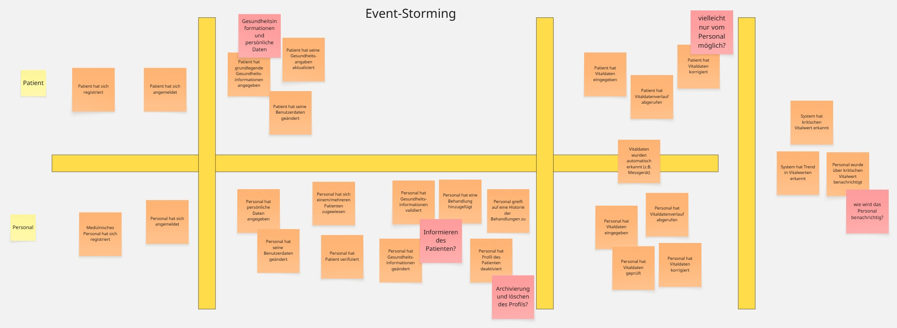
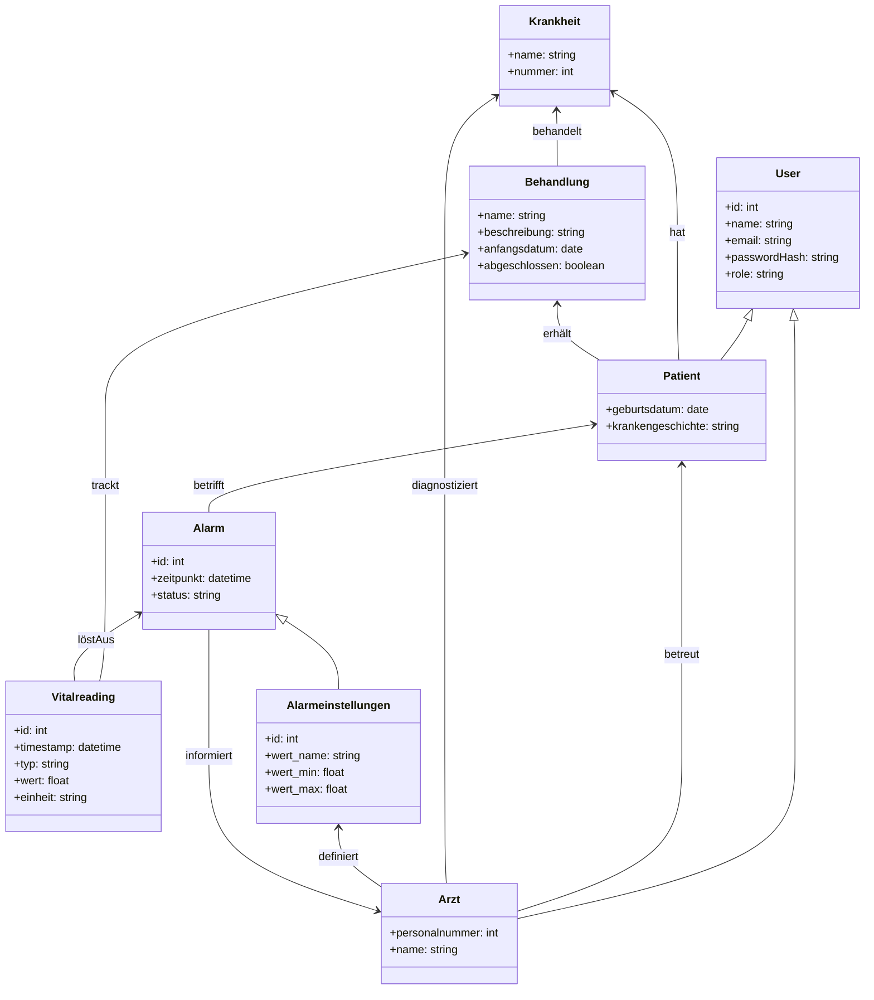

# 🩺 MediTrack 
ReadMe in der Anpassung, Update folgt. Ordner werden gerade angepasst und erste Klassen implementiert. 

**Hauptordner (alt):**<br />
MediTrack/src/main/java/ **de.meditrack** => veraltet<br />
MediTrack/src/test/java/ **de.meditrack** => veraltet<br />
<br />
**Hauptordner (neu):**<br />
MediTrack/src/main/java/ **com**.meditrack**<br />
MediTrack/src/test/java/ **com.meditrack**<br />


  
  


**MediTrack** ist ein Projekt zur **Verwaltung und Überwachung von Patientendaten**  
(Vitaldaten, Behandlungen, Geräte und Alerts) mit automatischen  
**Benachrichtigungen bei kritischen Werten**.

Dieses Dokument beschreibt das **Projekt MediTrack** – unabhängig von den
Übungsblättern – und fasst Architektur, Domäne und Deployment zusammen.

---

## 📋 Projektübersicht

**Ziel**

Ein System, das

- Patientendaten sicher verwaltet,
- Vitalwerte überwacht,
- medizinische Geräte und Behandlungen nachverfolgt,
- und bei kritischen Schwellen automatisch medizinisches Personal informiert.

**Kernfunktionen (MVP)**

- Registrierung & Login (Rollen: Patient, Arzt)
- Verwaltung von Stammdaten (Name, Geburtsdatum, Historie)
- Eingabe und Anzeige von Vitalwerten (Puls, Blutdruck, Temperatur, SpO₂ …)
- Automatisches Benachrichtigungssystem bei kritischen Werten (Alerts)
- Behandlungsübersicht mit Historie (Treatments)
- Zuordnung von Geräten zu Patienten (Devices)

---

## 👥 Team 2 – MediTrack

| Name                   | E-Mail (intern) | Discord           |
|------------------------|-----------------|-------------------|
| Konstantin Königshofen | –               | `konstantink4120` |
| Timo Nadolny           | –               | `nadolzetimo`     |
| Marcell Wolf de Lêu    | –               | `wolfdeleu`       |
| Ferdinand Stadler      | –               | `ferdi_29858`     |

*(E-Mails werden im öffentlichen Repo nicht hinterlegt.)*

---

## 🖥️ Technologie-Stack

- **Sprache:** Java 17+
- **Framework:** Spring Boot 3 (Web, Data JPA, Validation, Thymeleaf)
- **Datenbanken**
    - lokal: H2 (In-Memory / File)
    - Server: MySQL
- **Build-Tool:** Maven
- **Tests:** JUnit 5
- **CI/CD**
    - GitHub Actions (Maven-Build & Tests)
    - Jenkins + systemd (Deployment auf Linux-Server)
- **Frontend:** Thymeleaf-Templates, Bootstrap/CSS (klassische Server-Rendering-Ansicht)

---

## 🗂️ Repository-Struktur (vereinfacht)

```plaintext
MediTrack/
├── .github/
│   └── workflows/
│       └── maven-tests.yml       # GitHub Actions: mvn clean test
├── src/
│   ├── main/
│   │   ├── java/
│   │   │   └── de/
│   │   │       └── meditrack/
│   │   │           ├── controller/   # Web-Controller (Spring MVC)
│   │   │           ├── model/        # Entitäten (User, Patient, Doctor, ...)
│   │   │           ├── repository/   # Spring-Data-Repositories
│   │   │           └── MediTrackApplication.java
│   │   └── resources/
│   │       ├── templates/           # Thymeleaf HTML-Views
│   │       └── application.properties
│   └── test/
│       └── java/
│           └── de/
│               └── meditrack/       # Unit- und Integrationstests
├── Uebungen/                        # Kursunterlagen / PDFs (nicht Teil der App)
├── Jenkinsfile                      # Jenkins-Pipeline (Server & lokal)
├── README.md                        # dieses Dokument
└── pom.xml                          # Maven-Konfiguration
```

## ✅ Funktionale Anforderungen

1. **Registrierung & Login**  
   - Benutzer können sich registrieren und anmelden.  
   - Rollen: **Patient** und **Arzt** (später erweiterbar).  
   - Zugriff auf Funktionen und Daten ist rollenbasiert.

2. **Patientendatenverwaltung**  
   - Erfassung und Pflege von Stammdaten (Name, Geburtsdatum, Kontaktinformationen).  
   - Hinterlegung einer grundlegenden Krankengeschichte.  
   - Zuordnung eines verantwortlichen Arztes zu einem Patienten.

3. **Krankheits- und Behandlungshistorie**  
   - Anlage von **Krankheiten** (Diagnosen) pro Patient.  
   - Anlage von **Behandlungen** mit Bezeichnung, Beschreibung, Startdatum und Status (z. B. aktiv/abgeschlossen).  
   - Anzeige einer chronologischen Historie der Behandlungen je Patient.

4. **Vitaldaten-Erfassung**  
   - Erfassung von Vitalwerten (z. B. Blutdruck, Puls, Temperatur, SpO₂) mit Zeitstempel und Einheit.  
   - Anzeige der zuletzt erfassten Vitaldaten je Patient (Liste, später optional grafisch).

5. **Alarmsystem / Benachrichtigungen**  
   - Definition von **Schwellenwerten** für einzelne Vitalparameter (min/max).  
   - Automatisches Auslösen eines **Alarms**, wenn ein Wert außerhalb des definierten Bereichs liegt.  
   - Darstellung offener Alarme für das zuständige medizinische Personal.

6. **Alarmbearbeitung durch Personal**  
   - Einsicht in alle offenen Alarme der zugewiesenen Patienten.  
   - Aktualisierung des Alarmstatus (z. B. *neu*, *in Bearbeitung*, *geschlossen*).  
   - Dokumentation der ergriffenen Maßnahmen direkt am Alarm / in der Behandlung.

7. **Sicherheit & Validierung**  
   - Patienten sehen ausschließlich ihre eigenen Daten.  
   - Ärzte sehen nur die ihnen zugeordneten Patienten und deren Daten.  
   - Formularvalidierung (Pflichtfelder, Wertebereiche, sinnvolle Formate) zur Sicherstellung konsistenter Eingaben.

## 🎯 Akzeptanzkriterien (MVP)

- **Rollen & Zugriff**
    - Patienten können sich registrieren, anmelden und nur **ihre eigenen Daten** einsehen.
    - Ärztliches Personal kann sich anmelden und **zugewiesene Patienten** samt deren Daten verwalten.
    - Unberechtigter Zugriff (z. B. Patient auf fremde Patientenakte) ist nicht möglich.

- **Patientendatenverwaltung**
    - Stammdaten (Name, Geburtsdatum, Kontaktdaten) lassen sich anlegen, ändern und speichern.
    - Jeder Patient ist eindeutig identifizierbar.
    - Die Krankengeschichte eines Patienten ist einsehbar und kann erweitert werden.

- **Vitaldaten-Erfassung**
    - Für einen Patienten können Vitalwerte (z. B. Puls, Blutdruck, Temperatur, SpO₂) mit Zeitstempel erfasst werden.
    - Ungültige Eingaben (z. B. negative Werte, unmögliche Bereiche) werden abgewiesen und führen zu einer Fehlermeldung.
    - Die zuletzt erfassten Werte sind pro Patient übersichtlich abrufbar.

- **Alarmsystem**
    - Für jeden Vitalwert existieren **konfigurierbare Grenzwerte** (min/max).
    - Wird ein neuer Vitalwert erfasst, prüft das System automatisch, ob ein Grenzwert überschritten wird.
    - Bei Überschreitung wird automatisch ein **Alarm** erzeugt, der den betroffenen Patienten, den Wert, den Zeitpunkt und den Status enthält.
    - Alarme haben mindestens die Stati: `NEU`, `IN_BEARBEITUNG`, `GESCHLOSSEN`.

- **Alarmbearbeitung**
    - Ärztliches Personal sieht eine Liste aller **offenen Alarme** (mindestens Status `NEU`).
    - Der Status eines Alarms kann geändert werden (z. B. von `NEU` → `IN_BEARBEITUNG` → `GESCHLOSSEN`).
    - Eine kurze Notiz / Maßnahme kann am Alarm hinterlegt werden.

- **Behandlungsübersicht**
    - Zu einem Patienten können **Behandlungen** angelegt werden (Name, Beschreibung, Startdatum, optional Enddatum).
    - Behandlungen sind mit Patient und – optional – mit einem Arzt verknüpft.
    - Abschlossene Behandlungen sind als solche erkennbar und bleiben in der Historie sichtbar.

- **Systemqualität**
    - Zentrale Use-Cases (Login, Patientenanzeige, Vitalwert-Erfassung, Alarm-Anzeige) sind automatisiert getestet.
    - Die Anwendung startet ohne Fehlermeldungen und ist über den konfigurierten Port (z. B. `http://localhost:9090`) erreichbar.
    - Bei fehlerhaften Eingaben werden Nutzer verständlich informiert (kein technischer Stacktrace im Browser).


## 🧩 Eventstorming

> *Event Storming* ist eine Methode, um zwischen **Entwicklern** und  
> **Domain-Experten** ein gemeinsames Verständnis über die Domäne  
> und deren Prozesse zu schaffen. Dabei werden die wichtigsten  
> Ereignisse (Events) und deren Auslöser visuell dargestellt.

### 🧠 Legende

- 🟧 **Domain Event** – fachliche Veränderung im System  
  (z. B. *PatientRegistriert*, *VitaldatenErfasst*, *AlarmAusgelöst*)
- 🟨 **Actor** – Akteur (z. B. Patient, Arzt, System)
- 🟥 **Hot Spot** – offener Punkt, Problem oder Diskussionsbedarf

### 🎯 Ziel der Session

Ziel der Eventstorming-Session war es, die Abläufe von **MediTrack**  
zu verstehen und die wichtigsten Ereignisse zu identifizieren –  
von der Registrierung über die Erfassung von Vitaldaten bis zur  
Benachrichtigung des medizinischen Personals bei kritischen Werten.

### 🧩 Hauptakteure

| Akteur  | Beschreibung                                            |
|--------|----------------------------------------------------------|
| 🧍‍♂️ Patient | Gibt Gesundheits- und Vitaldaten ein, sieht Verlauf    |
| 🩺 Arzt    | Prüft Daten, ergänzt Behandlungen, reagiert auf Alarme |
| ⚙️ System  | Speichert Daten, prüft Schwellenwerte, löst Alarme aus |

### 🔄 Beispielhafter Ablauf (vereinfacht)

1. **PatientRegistriert**
2. **PatientGibtGesundheitsdatenEin**
3. **VitaldatenErfasst**
4. **SystemPrüftSchwellenwerte**
5. **AlarmAusgelöst** bei kritischem Wert
6. **ArztBenachrichtigt**
7. **BehandlungAktualisiert** / neue Behandlung angelegt

### 📸 Visualisierung des Eventstormings

Im Repository ist ein Bild des finalen Eventstorming-Boards hinterlegt:



Es zeigt:

- alle identifizierten **Events** (z. B. *PatientRegistriert*,  
  *VitaldatenErfasst*, *AlarmAusgelöst*),
- beteiligte **Akteure** (Patient, Arzt, System),
- markierte **Hotspots**, an denen noch fachliche oder technische  
  Fragen geklärt werden müssen.

Dieses Board dient als lebende Grundlage für das **Domänenmodell**,  
die **UML-Klassendiagramme** und die spätere Implementierung.


## 🧩 Domänenmodell (UML)

Das Domänenmodell von **MediTrack** bildet die wichtigsten Entitäten und ihre Beziehungen ab.  
Im Fokus stehen Patienten, Ärzte, Geräte, Vitaldaten, Behandlungen und Alarme.



### Wichtige Entitäten

- **User**
    - Basisklasse für alle Benutzer im System.
    - Attribute (Auswahl): `userId`, `username`, `passwordHash`, `email`.
    - Wird von `Patient` und `Doctor` spezialisiert (Vererbung).

- **Patient** *(erbt von User)*
    - Repräsentiert einen Patienten im System.
    - Attribute (Auswahl): `dateOfBirth`.
    - Beziehungen:
        - 1:n zu **Treatment** (ein Patient hat mehrere Behandlungen).
        - 1:n zu **Alert** (ein Patient kann mehrere Alarme auslösen).
        - 1:n zu **Device** (ein Patient kann mehrere Geräte besitzen).
        - n:m zu **Doctor** (ein Patient kann von mehreren Ärzten betreut werden).

- **Doctor** *(erbt von User)*
    - Repräsentiert medizinisches Personal (z. B. Arzt/Ärztin).
    - Attribute (Auswahl): `personalNumber`, `specialization`.
    - Beziehungen:
        - n:m zu **Patient** (ein Arzt kann mehrere Patienten betreuen und umgekehrt).

- **Device**
    - Medizingerät, das einem Patienten zugeordnet ist.
    - Attribute (Auswahl): `deviceId`, `model`, `status`, `lastServiceDate`.
    - Beziehung:
        - n:1 zu **Patient** (ein Patient kann mehrere Geräte haben, ein Gerät gehört genau einem Patienten).

- **Treatment**
    - Behandlungs­einheit oder Therapieplan eines Patienten.
    - Attribute (Auswahl): `treatmentId`, `assessmentDate`, `plannedEndDate`, `active`.
    - Beziehungen:
        - n:1 zu **Patient** (jede Behandlung gehört zu genau einem Patienten).
        - 1:n zu **VitalData** (eine Behandlung umfasst viele Messwerte).

- **VitalData**
    - Einzelner Vitalwert (Messpunkt) im zeitlichen Verlauf.
    - Attribute (Auswahl): `heartRate`, `spo2`, `sysBp`, `diaBp`, `temp`, `timestamp`.
    - Beziehungen:
        - n:1 zu **Treatment** (Messung gehört zu einer Behandlung).
        - 0..1:1 zu **Alert** (ein kritischer Messwert kann einen Alarm auslösen).

- **Alert**
    - Repräsentiert einen ausgelösten Alarm bei kritischen Vitalwerten.
    - Attribute (Auswahl): `alertId`, `alertLevel`, `message`, `createdAt`, `resolved`.
    - Beziehungen:
        - n:1 zu **Patient** (Alarm gehört zu einem Patienten).
        - n:1 zu **VitalData** (Alarm basiert auf einem konkreten Messwert).

### Kurzfassung

- **User** ist die abstrakte Basis für **Patient** und **Doctor**.
- **Patient** ist die zentrale Entität, der **Behandlungen**, **Geräte**, **Vitaldaten** und **Alarme** zugeordnet sind.
- **VitalData** wird innerhalb eines **Treatment** erfasst und kann einen **Alert** auslösen.
- **Doctor** ist über eine n:m-Beziehung mit **Patient** verbunden und reagiert auf ausgelöste Alarme.


```markdown
Diese Punkte fehlen noch:
🧱 Bounded Contexts
🧬 Entitäten und Aggregate
⚙️ Domain Services und Repositories
🚀 Lokale Entwicklung 
🔧 Deployment & CI/CD
📄 Lizenz