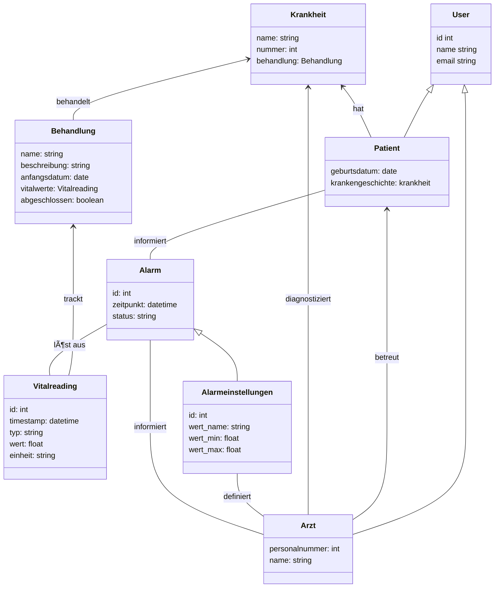

# MediTrack

**MediTrack** ist ein Projekt zur **Verwaltung und Überwachung von Patientendaten** (einschließlich Vitaldaten und Behandlungshistorie) mit automatischen **Benachrichtigungen bei kritischen Werten**. Dieses Dokument dient **ausschließlich der Orientierung und Formatierung**. Inhalte, technische Details und Umsetzungen werden **im Verlauf des Projekts fortlaufend angepasst und konkretisiert.**

---

## 📋 Projektübersicht

**Ziel:**  
Ein System, das Patientendaten sicher verwaltet, Vitalwerte überwacht und bei kritischen Schwellen automatisch medizinisches Personal informiert.

**Kernfunktionen (MVP):**
- Patientenregistrierung & Authentifizierung (mit Rollen)
- Verwaltung von Stammdaten (Name, Geburtsdatum, Krankengeschichte)
- Eingabe und Anzeige von Vitalwerten (Blutdruck, Puls, Temperatur)
- Automatisches Benachrichtigungssystem bei kritischen Werten
- Behandlungsübersicht mit Historie

---

## 👥 Team 2 – MediTrack

| Name                    | E-Mail                                   | Discord          |
|-------------------------|------------------------------------------|------------------|
| Konstantin Königshofen  | k.koenigshofen@ostfalia.de               | konstantink4120  |
| Timo Nadolny            | timo.nadolny@stud.th-luebeck.de          | nadolzetimo      |
| Marcell Wolf de Lêu     | bht@wolfdel.eu                           | wolfdeleu        |
| ~~Lea Ebitsch~~         | ~~ebitsch@th-brandenburg.de~~            | ~~leae1010~~     |
| ~~Jessica Windoffer~~   | ~~jessica.windoffer@stud.th-luebeck.de~~ | ~~j.windoffer~~  |


---

## 🧱 Projektstruktur (Vorschlag)

### 🖥️ Technologie-Stack
...

### 🗂️ Repository-Struktur

```plaintext
MediTrack/
├── backend/
│ ├── src/
│ └── target/
...
└── README.md
```

---

## ⚙️ Funktionale Anforderungen (aus Aufgabenbeschreibung)

1. **Registrierung & Login** – mit rollenbasierter Authentifizierung (Patient, medizinisches Personal)
2. **Patientendatenverwaltung** – Eingabe & Änderung grundlegender Daten
3. **Vitaldaten-Erfassung** – Blutdruck, Puls, Temperatur etc.
4. **Benachrichtigungssystem** – automatische Alarme bei Schwellenüberschreitungen
5. **Behandlungsübersicht** – Historie der Behandlungen und Eingriffe

---

## 🎯 Akzeptanzkriterien (MVP)

- **Patientenrolle:** Zugriff nur auf eigene Daten  
- **Personalrolle:** Zugriff auf zugewiesene Patienten  
- **Validierung:** Eingaben werden auf Wertebereiche geprüft  
- **Alerts:** Kritische Werte lösen Benachrichtigung innerhalb von 1 Minute aus  
- **Historie:** Änderungen versioniert & nachvollziehbar  

---

## Eventstorming

- Eine Möglichkeit, um zwischen Entwicklern und Domain Experten zu einem gemeinsamen Verständnis von User-Stories zu kommen.
- Domain Event (Orange), HotSpot (rot), Actor (gelb)


## 🧩 Domänenmodell (Entwurf)


## 🧩 Domänenmodell (Entwurf2)



## 🧩 Bounded Context (Entwurf)
Hier müssen noch die Bounded Contexts erstellt werden. 
Ich sehe die Contexts in folgenden Bereichen:
1) Registrierungsvorgang Arzt/Patient
2) Stammdatenerfassung
3) Krankheitshistorie
4) Erfassung Werte
5) Alarmsystem / Notification-Center

## 🧩 Bounded Context
- Ein definierter Teil einer Software, welcher eigene Regeln, Grundsätze, Strategien oder Richtlinien besitzt, sowie eine eigene Sprache (Ubiquitous Language) aufweist.
- Domains oder Subdomains können mehrere Bounded Contexts enthalten. Allerdings sollte sich ein Bounded Context nicht über mehrere Domains hinweg erstrecken. 

| Bounded Context| Verantwortlichkeiten| Beziehung zu anderen BCs|
|---------------|--------|----------------|
| Registrierungsvorgang  | Patient/Arzt kann sich registrieren und anmelden. | Vorraussetzung für alle anderen BCs  |
| Stammdatenerfassung | Patient kann seine Daten (Name, Geburtsdatum, Krankheitsgeschichte) angeben und verwalten. | Die angegebene Krankheitsgeschichte wird vom BC "Krankheitshistorie" verwendet und ggf. erweitert |
| Krankheitshistorie| Patient/Arzt können auf Krankheitshistorien zugreifen und diese erweitern.| Die ursprüngliche Krankheitsgeschichte wird im BC "Stammdatenerfassung" erstellt. |
| Erfassung Werte| Die Vitalwerte vom Patienten können erfasst und gespeichert werden.| Wenn der erfasste Wert seinen Schwellenwert übersteigt, wird das Alarmsystem aktiviert. |
| Alarmsystem / Notification-Center| Es werden kritische Vitalwerte erkannt und der Arzt wird benachrichtigt.| Das Alarmsystem enthält und überprüft die Daten vom BC "Erfassung Werte". |

